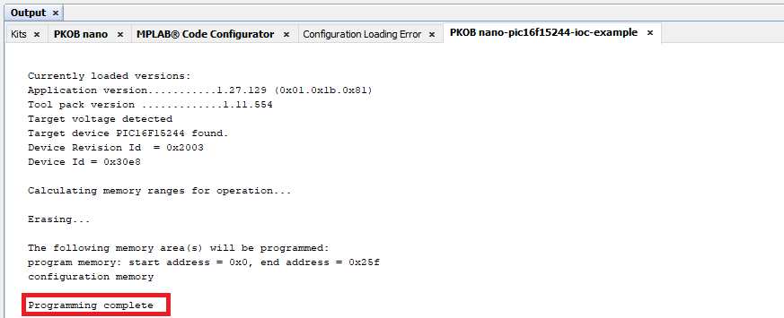

<a href="https://www.microchip.com" rel="nofollow"></a>

# Transmit "Button pressed" using Interrupt-on-Change with PIC16F15244

The 'pic16f15244-ioc-example' code example uses the PIC16F15244 Curiosity Nano Development board to demonstrate how to transmit "Button pressed!" to a PC terminal application each time the Nano's push-button (SW0) is pressed. The example highlights the use of the Interrupt-on-Change (IOC) and EUSART modules.

##### PIC16F15244 Curiosity Nano Development Board:


## Related Documentation
- [PIC16F15244 Product Page](https://www.microchip.com/wwwproducts/en/PIC16F15244)

## Software Used
- MPLAB® X IDE 5.45 or newer [(microchip.com/mplab/mplab-x-ide)](http://www.microchip.com/mplab/mplab-x-ide)
- MPLAB® XC8 2.31 or a newer compiler [(microchip.com/mplab/compilers)](http://www.microchip.com/mplab/compilers)
- MPLAB® Code Configurator (MCC) 4.1.0 or newer [(microchip.com/mplab/mplab-code-configurator)](https://www.microchip.com/mplab/mplab-code-configurator)
- Microchip PIC16F1xxxx Series Device Support (1.5.133) or newer [(packs.download.microchip.com/)](https://packs.download.microchip.com/)


## Hardware Used
- PIC16F15244 Curiosity Nano [](https://www.microchip.com/Developmenttools/ProductDetails/EV09Z19A)
- Micro-USB to USB 2.0 cable

## Setup
1. Connect the PIC16f15244 Curiosity Nano board to a PC using the Micro-USB to USB 2.0 cable.
2. If not already on your system, download and install MPLABX IDE version 5.40 (or newer).
3. If not already on your system, download and install the XC8 C-Compiler version 2.20 (or newer).
4. Open the 'pic16f15244-ioc-example.X' project as shown in Figure 1.

  ###### Figure 1: Open Project Window
  

5. Press the 'Project Properties' button to open the Project Properties window. Select the Curiosity tool from the Tools drop-down menu as shown in Figure 2.

  ###### Figure 2: Select the Nano in Project Properties Window
  

6. Press the 'Make and Program Device' button to program the PIC (see Figure 3). Verify that the device was successfully programmed (see Figure 4).

  ###### Figure 3: 'Make and Program Device' Button
  

  ###### Figure 4: Program Complete
  

7. For Windows PC: Open a terminal program. For this example, Tera Term was used as the terminal program.

  a. Select the port that is used by the Nano board as shown in Figure 5. <br />
  b. Configure the serial port as shown in Figure 6. <br />
  ###### Figure 5: Select the USB Port
  

  ###### Figure 6: Configure the Serial Port
  
  
8. For MacOS: Open a terminal program. For this example, open a Terminal.app window. We shall use `screen` as the terminal program. 

  a. With the project loaded in MPLAB & the Curiosity Nano board connected to the Mac's USB port: 
    Find the tty device being used:  

    ```zsh  
    % ls -l /dev | grep tty.usb          # search for a tty.usb connection  
    crw-rw-rw-  1 root    wheel           18,   4 May  8 01:06 tty.usbmodem14102  
    %  
    ```  

  b. start `screen` in Terminal.app & configure the serial port in one command:  

    ```zsh 
    % screen  /dev/tty.usbmodem14102 9600  
    ```  

    You should now be connected to the serial port, and see the messages appear in `screen` on Terminal.app when the button is pushed.
    Also note that the tty will change from time to time, but will always begin with `.usbmodem`
## Operation
After the Nano board is programmed, the EUSART module will transmit the string "Button pressed!" to the PC terminal window each time push-button SW0 is pressed.

Input pin RC2 is connected to the output of SW0. Pin RC2 is pulled to a logic 'HIGH' state during normal operation. When SW0 is pressed, the internal circuit of the button makes a complete connection, allowing the voltage to flow through the pin to ground. When this transition of a logic 'HIGH' to logic 'LOW' occurs, IOC hardware detects this change and issues a negative-edge interrupt. The Interrupt Service Routine (ISR) will then clear the IOCCF flag and transmit the string 'Button pressed!' over the EUSART. The IOC edge selection can be configured in MCC as shown in Figure 7.

  ###### Figure 7: IOC Edge Selection in MCC
  

Output pin RC0 is configured as the TX output through PPS. Nano hardware also connects pin RC0 to the USB receive line, allowing a quick connection to the PC terminal without any additional wires or USB bridge circuits.

The EUSART module is configured to use the `printf()` function call that it built in to the XC8 libraries. In MCC, simply mark the 'Redirect STDIO to USART' check-box as shown in Figure 8, and the additional function calls are added to the project. Example 1 shows the use of the `printf()` function in the IOC ISR.

  ###### Figure 8: 'Redirect STDIO to USART' Check-box
  


###### Example 1: IOCCF Interrupt Service Routine Code Snippet

    void IOCCF2_ISR(void)                     // IOCCF2 Interrupt Service Routine
    {
      if(IOCCF2_InterruptHandler)
      {
          IOCCF2_InterruptHandler();
      }
      IOCCFbits.IOCCF2 = 0;
    }

    void IOCCF2_DefaultInterruptHandler(void)  // Default interrupt handler for IOCCF2
    {
        printf("Button pressed! \r\n");
    }


## Summary
The 'pic16f15244-ioc-example' code example uses the PIC16F15244 Curiosity Nano Development board to demonstrate how to transmit 'Button pressed!' to a PC terminal window each time push-button SW0 is pressed. The example uses the Interrupt-on-Change (IOC) module to detect a positive to negative-edge transition on the input pin, and the EUSART module to transmit the string 'Button pressed!' to the PC terminal window.

###### Figure 9: Button Pressed!

